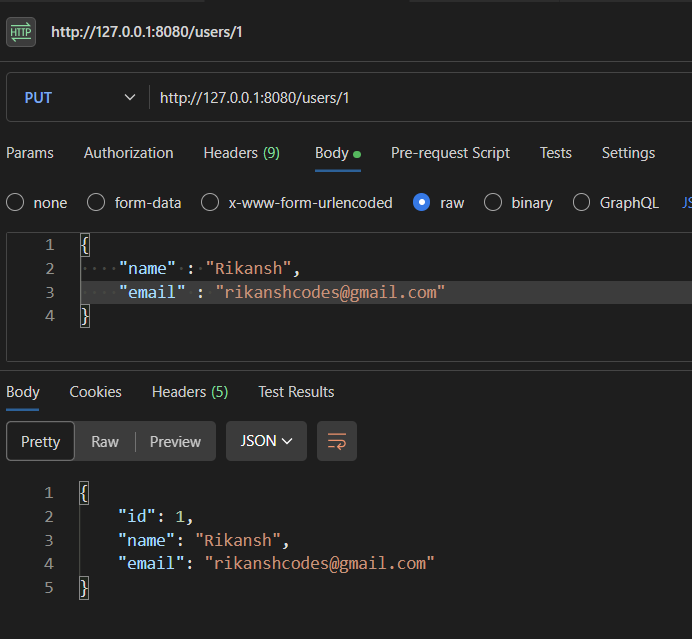

# CRUD Application with H2 Database using Spring Boot
This respository contains a CRUD application built using Spring Boot and H2 in-memory database with VS Code IDE . It provides a RESTful API to perform CRUD operations on a resource.

## Setup
Pre-requisites : 
- Install the Coding Pack for Java - [here](https://code.visualstudio.com/docs/languages/java#_install-visual-studio-code-for-java) 
- Install Java Extension Pack and Spring Boot Extension Pack from [here.](https://code.visualstudio.com/docs/java/extensions)
- Refer to this youtube video to understand how to initiate a project after the above two steps
: [www.youtube.com/setup](https://www.youtube.com/watch?v=dq1z9t03mXI)

- Clone the repository
```bash
git clone https://github.com/lgsurith/springboot-h2-db-crud.git
cd springboot-h2-db-crud
```
- Build and run the application
```bash
mvn spring-boot:run
```
- Access the H2 Console :  To acces the H2 Console , navigate to ```http://localhost:8080/h2-console``` in your web browser after starting the application to check if h2 database is connected or not , but before that please ensure to put these details in ```application-properties```
```bash
spring.h2.console.enabled=true
spring.datasource.url=jdbc:h2:mem:dcbapp
spring.datasource.driverClassName=org.h2.Driver
spring.datasource.username=sa
spring.datasource.password=<your-password>
spring.jpa.database-platform=org.hibernate.dialect.H2Dialect
```

## API Endpoints
- **GET - /users/test**

  To Check if the port works :)
  
  

- **GET - /users**

  Gets all the users !

  

- **POST - /users**

  Allows the user to add name and email to h2-db.

  

- **GET - /users/id**
  
  Get a user by an unique ID.

  

- **PUT -/users/id**

  To update users information by their unique ID.

  

- **DELETE -/users/id**

   To delete the user by their unique ID.

  
  
## h2 console :


